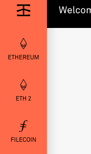
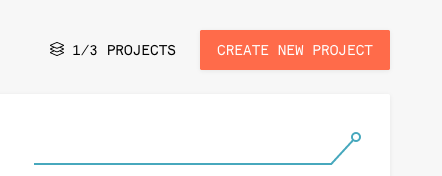
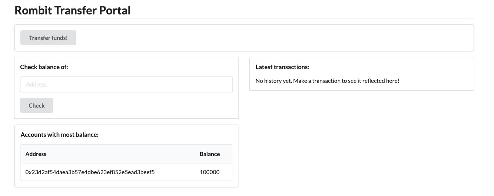

# How to deploy to rinkeby

## Create and configure infura account:
1. Go to https://infura.io and create a new account or log in to existing account


2. Once in the infura dashboard go to the ETHERUM section



3. Create a new project:



4. Once the project is created, go to settings then to keys section. A new htp url will be created with the project id like: `https://mainnet.infura.io/v3/<TOKEN>` for test net we will be replacing `mainnet` with `rinkeby` from now on.

5. Make sure you have balance on your wallet to perform the deploy on the rinkeby network. Go to https://www.rinkeby.io/#faucet to get ETH if needed.

## Contract deploy

1. Using the project generated url lets deploy the contract (your wallet private account is required)
```sh
$ ./rombit-token-backend-1.0.0/bin/rombit-token-backend deploy --initial-supply 100000 --url https://rinkeby.infura.io/v3/<TOKEN>
Please enter private key to use for deploy:
Contract deployed at: 0x4a44f0b7002e4da13f6aeffbff300f40bf229994
``` 

This will get us the contract address on the rinkeby network

## Connecting transaction portal to deployed contract

1. Lets connect using the obtained contract address and the same rinkeby url  
```sh
$ ./rombit-token-backend-1.0.0/bin/rombit-token-backend app --url https://rinkeby.infura.io/v3/<TOKEN> --address 0x4a44f0b7002e4da13f6aeffbff300f40bf229994 --port 8080
```

2. Go to transaction portal running on http://localhost:8080/. You will need to enter the private key to log in.


